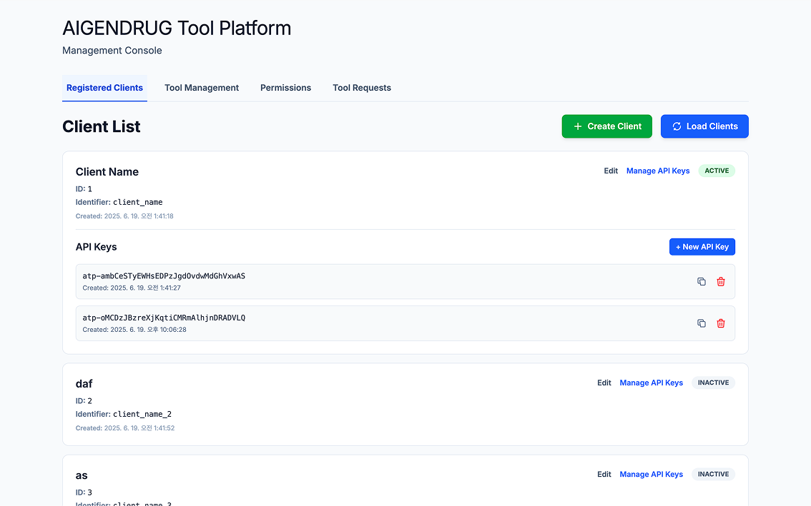
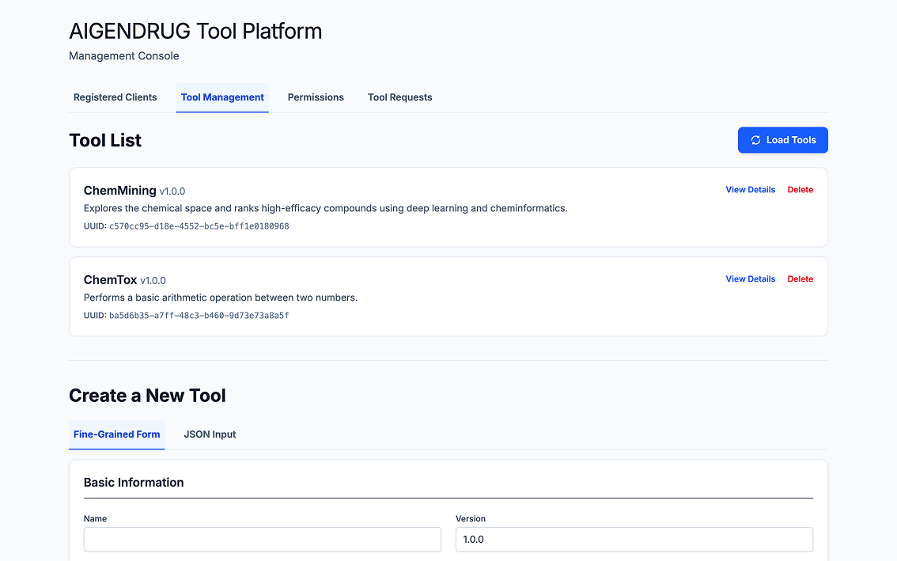
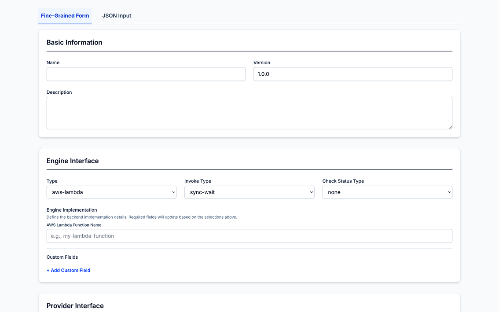
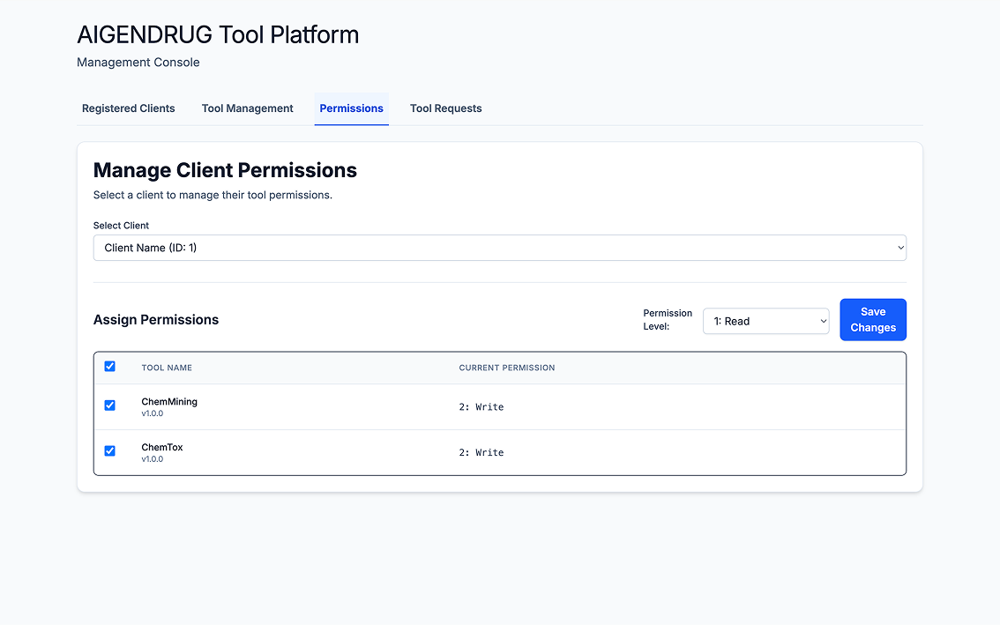

# ATP-Central

AIGENDRUG Tool Platform, Central service

## Authors

Course Information: 2025 Seoul Nat'l University, Creative Integrated Design 2

Group A:

- Yang Gil Mo - [AtlasYang](https://github.com/AtlasYang)
- Khinwaiyan - [khinwaiyan](https://github.com/khinwaiyan)
- Kim Da In - [dida0423](https://github.com/dida0423)

## Introduction

**ATP-Central** is the core orchestration service of the **AIGENDRUG Tool Platform**, providing intelligent tool selection and centralized tool lifecycle management. This service leverages fine-tuned Large Language Models (LLM) to analyze user prompts and automatically match them with the most appropriate tools from database.

The platform serves as a centralized hub that enables administrators to configure and manage various tool providers including AWS Lambda functions, HTTP API endpoints, and custom computational services. Through sophisticated AI-driven selection algorithms, ATP-Central ensures optimal tool routing while maintaining a unified interface for client applications.

### Key Features

- **Intelligent Tool Selection**: Utilizes a fine-tuned LLaMA model with LoRA adapters for context-aware tool matching
- **Multi-Provider Support**: Seamless integration with AWS Lambda, HTTP APIs, and custom service providers  
- **Centralized Lifecycle Management**: Complete tool execution orchestration from selection to result delivery
- **API Key Authentication**: Secure client access control with session-based authentication
- **RESTful Architecture**: Clean API design following domain-driven development patterns
- **Real-time Processing**: Efficient tool selection using TF-IDF vectorization and cosine similarity

### Architecture Overview

ATP-Central follows a microservices architecture with three primary components:

#### Router-Core (Go/Gin)
The main HTTP server built with Go and Gin framework, implementing clean architecture principles:
- **Domain Layer**: Tool entities, client management, and business logic
- **Application Layer**: Service orchestration and DTOs
- **Infrastructure Layer**: PostgreSQL persistence and external integrations
- **Delivery Layer**: REST API handlers and middleware

Key capabilities:
- Tool CRUD operations and metadata management
- Client authentication and session handling
- Request routing and response aggregation
- Integration with external tool providers (AWS Lambda, HTTP endpoints)

#### Selector (Python/FastAPI)
An AI-powered tool selection service that combines traditional ML and fine-tuned LLM inference:
- **Hybrid Selection Algorithm**: Initial candidate filtering using TF-IDF vectorization followed by LLM-based final selection
- **Fine-tuned Model**: Custom LoRA adapter trained on tool selection datasets
- **Performance Optimization**: 4-bit quantization support for efficient GPU utilization
- **Scalable Architecture**: Asynchronous processing with FastAPI

#### Database (PostgreSQL)
Centralized data persistence layer storing:
- Tool registry with metadata and configuration
- Client credentials and session information
- Execution logs and analytics data

## Technology Stack

- **Backend Framework**: [Go Gin](https://gin-gonic.com/) - High-performance HTTP web framework
- **AI/ML Service**: [FastAPI](https://fastapi.tiangolo.com/) - Modern Python web framework for APIs
- **Database**: [PostgreSQL](https://www.postgresql.org/) - Advanced open-source relational database
- **Machine Learning**: 
  - [Transformers](https://huggingface.co/transformers/) - State-of-the-art ML models
  - [PyTorch](https://pytorch.org/) - Deep learning framework
  - [scikit-learn](https://scikit-learn.org/) - Machine learning library
- **Documentation**: [Swagger/OpenAPI](https://swagger.io/) - API documentation and testing
- **Containerization**: [Docker](https://www.docker.com/) - Application containerization
- **Cloud Integration**: [AWS SDK](https://aws.amazon.com/sdk-for-go/) - AWS Lambda and service integration

## Getting Started

### Prerequisites

For self-hosted deployment on on-premise servers:
- Docker and Docker Compose
- Python 3.11+
- Linux environment (Ubuntu 20.04+ recommended)
- NVIDIA GPU with CUDA support (recommended for AI model inference)
- Minimum 4GB RAM, 50GB storage

### Configuration

Before deployment, you'll need to configure environment variables:

#### Required Environment Variables

- **POSTGRES_PASSWORD**: Secure password for PostgreSQL database
- **HUGGINGFACE_TOKEN**: Token for accessing Hugging Face models ([Get token here](https://huggingface.co/settings/tokens))
- **AWS_REGION**, **AWS_ACCESS_KEY_ID**, **AWS_SECRET_ACCESS_KEY**: Required only if using AWS Lambda functions
- **POSTGRES_DB**: Database name (default: postgres)
- **Database and service ports**: Customize if default ports conflict with your setup

All configuration options are documented in the `.env.template` file with placeholder values and descriptions.

### Installation

#### Self-Hosted Deployment

The self-hosted setup uses Docker Compose for simplified deployment:

1. **Environment Configuration**
   ```bash
   # Copy environment template and configure your settings
   cp env.template .env
   
   # Edit the .env file with your actual values:
   # - Set POSTGRES_PASSWORD to a secure password
   # - Add your HUGGINGFACE_TOKEN
   # - Configure AWS credentials if using Lambda functions
   # - Adjust ports if needed
   vim .env  # or use your preferred editor
   ```

2. **Deploy All Services**
   ```bash
   # Start all services with Docker Compose
   docker compose up -d
   ```

#### AWS Cloud Deployment

For production cloud deployment:

1. **Database**: Deploy PostgreSQL using Amazon RDS
2. **Router-Core**: Deploy to EC2 instances with auto-scaling groups
3. **Selector**: Deploy to GPU-enabled EC2 instances
4. **Load Balancing**: Configure Application Load Balancer for high availability

Environment variables and detailed deployment scripts are provided in each component directory.

### Fine-tune strategy

Selector server uses fine-tuned LoRA adapter to enhance inference accuracy & create more precise answer structure. Below section guides you how to properly fine-tune open-source LLM model for Selector service.

#### Dataset Preparation

Create a dedicated directory for fine-tuning (e.g., `fine-tuning/`) and prepare two types of CSV datasets:

**Tool Registry Dataset (`ai_tools.csv`)**
```csv
intended_tool_name,description,use_cases,keywords
DrugAI_0001,Repurposes existing drugs through random forest models-based analysis of drug-disease relationships.,"['Repurposing antiviral drugs for cancer.', 'Repurposing antiviral drugs for diabetes.']","['network propagation', 'disease mapping', 'drug repurposing']"
```

**User Prompt Dataset (`ai_tool_user_prompts_dataset_en.csv`)**
```csv
intended_tool_name,user_prompt
ChemMining,I'm trying to accomplish Identification of hit compounds for pharmacological chaperones. — any tool recommendations?
ChemMining,Any suggestions for tools specializing in deep learning?
```

**Directory Structure**
```
fine-tuning/
├── datasets/
│   ├── ai_tools.csv
│   ├── ai_tool_user_prompts_dataset_en.csv
│   └── ai_tool_user_prompts_dataset_ko.csv (optional)
├── train.py
└── test.py
```

#### Training Approach

**RAG-Enhanced Tool Selection**
- **Base Model**: LLaMA-3.1-8B-Instruct
- **Training Format**: Context-aware selection with tool descriptions
- **Features**: Includes negative sampling for improved discrimination
- **Use Case**: Sophisticated tool selection with detailed reasoning

```python
# Example RAG training format
user_content = f"{instruction}\n\n{context_with_available_tools}"
messages = [
    {"role": "user", "content": user_content},
    {"role": "assistant", "content": correct_tool_name}
]
```

The training process combines user prompts with available tool descriptions, allowing the model to make informed decisions based on context rather than simple pattern matching.

#### Training Configuration

**LoRA Parameters**
- `r=16`: Low-rank adaptation rank
- `lora_alpha=32`: LoRA scaling parameter
- `lora_dropout=0.05`: Dropout rate for regularization
- **Target Modules**: All attention and MLP layers

**Training Parameters**
- **Epochs**: 3
- **Batch Size**: 4 per device
- **Learning Rate**: 2e-4 with cosine scheduler
- **Optimizer**: PagedAdamW with 8-bit quantization
- **Precision**: BFloat16 for memory efficiency

#### Production Deployment

Fine-tuned adapters are automatically saved to output directories (e.g., `sft-final-adapter/`, `sft-output/`). To deploy:

1. Copy the trained adapter to your Selector service directory
2. Update the `adapter_path` in your Selector service configuration
3. Restart the Selector service to load the new adapter

The fine-tuned model maintains the same inference API while providing significantly improved tool selection accuracy.

> **Note**: The training scripts and datasets mentioned in this guide should be created separately as they are not included in this repository. Refer to the configuration parameters and examples above to implement your own fine-tuning pipeline.

### Navigating the Application

The Router-Core server provides a convenient admin console application at `/console`.

**Clients management**



- Register new clients.
- Manage API Key that allows each client to access tools.

**Tool Management**



- Check details of registered tools.

**Tool Registration**



- Register new tools using pre-defined infrastructure information.
- Specify AWS Lambda function name to successfully invoke externel tool.

**Permissions**



- Administrator can assign specific permissions to each clients.
- Permissions
`Write`: Client can read tool information, request / response data, create new reqeust.
`Read`: Client can only read tool information, request / response data.
`None`: Client are not allowed to access the tool.